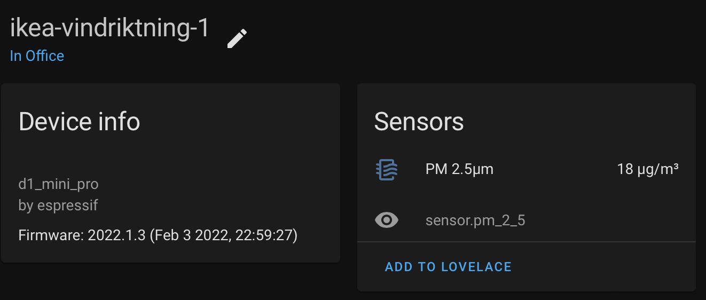

# ESPHome VINDRIKTNING Particle Sensor

The IKEA VINDRIKTNING particle sensor is [simple and cheap](https://www.ikea.com/au/en/p/vindriktning-air-quality-sensor-50498243/), costing only $15 AUD. It's easy to attach an ESP device to three test points on the device's PCB to read the communication between the sensor and the IC on the board. 

This project takes the excellent work of Sören Beye in the [Hypfer/esp8266-vindriktning-particle-sensor](https://github.com/Hypfer/esp8266-vindriktning-particle-sensor) project and incorporates it into a custom ESPHome component that can be used as an [External ESPHome component](https://esphome.io/components/external_components.html).


| Device in Home Assistant | PM 2.5 over time |
| --- | --- |
|  |  |

## Rationale

Most of the boilerplate code and configuration of the original project can be abstracted away by ESPHome. Things like Wifi configuration, OTA updates, Home Assistant auto discovery and integration and UART setup can be configured with a YAML file. 

The original project contains a moving average value for the sensor, this can be replicated with a [sliding_window_moving_average](https://esphome.io/components/sensor/index.html#sliding-window-moving-average) filter on the sensor.

## Prerequisites

To attach your ESP8266 to your sensor, follow the excellent build instructions contained within the [original README](https://github.com/Hypfer/esp8266-vindriktning-particle-sensor#readme).

## Example YAML

```yaml
esphome:
    name: vindriktning-pm-1
    platform: ESP8266
    board: d1

external_components:
- source: github://jessedc/esphome-vindriktning-particle-sensor@main
  components: [ vindriktning ]
  refresh: 0s

logger:

api:

ota:
    password: !secret ota_password

wifi:
    ssid: !secret wifi_ssid
    password: !secret wifi_password

uart:
    id: uart_bus
    rx_pin: GPIO4
    tx_pin: GPIO5 # Unused
    baud_rate: 9600

sensor:
- platform: vindriktning
  id: uart_vindrikning_pm25
  name: PM 2.5μm
  filters:
    - sliding_window_moving_average:
        window_size: 5
        send_every: 5
```

## Example Log

```
[22:07:10][D][vindriktning:031]: Received PM 2.5 reading: 15
[22:07:12][D][vindriktning:031]: Received PM 2.5 reading: 15
[22:07:33][D][vindriktning:031]: Received PM 2.5 reading: 15
[22:07:34][D][vindriktning:031]: Received PM 2.5 reading: 15
[22:07:36][D][vindriktning:031]: Received PM 2.5 reading: 15
[22:07:36][D][sensor:125]: 'PM 2.5μm': Sending state 15.00000 µg/m³ with 0 decimals of accuracy
[22:07:38][D][vindriktning:031]: Received PM 2.5 reading: 15
[22:07:41][D][vindriktning:031]: Received PM 2.5 reading: 15
[22:07:43][D][vindriktning:031]: Received PM 2.5 reading: 15
[22:07:45][D][vindriktning:031]: Received PM 2.5 reading: 15
[22:08:06][D][vindriktning:031]: Received PM 2.5 reading: 17
[22:08:06][D][sensor:125]: 'PM 2.5μm': Sending state 15.40000 µg/m³ with 0 decimals of accuracy
```

## Build Photos

I followed the [instructions](https://github.com/Hypfer/esp8266-vindriktning-particle-sensor#readme) to build my own ESP8266 powered Vindriktning sensor, wiring up Gnd, 5V and the single data pin then stuffing it all back into the enclosure.


| PCB with wires | Wemos D1 Mini attached |
| --- | --- |
|  |  |


